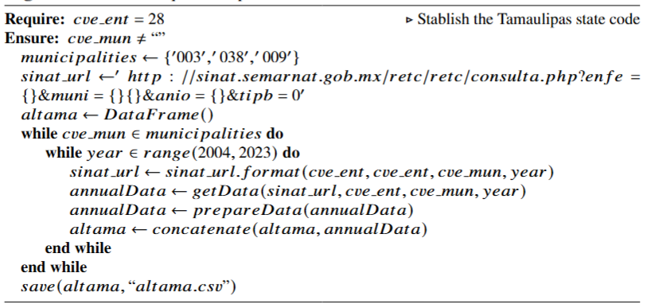

# Eureka2024AdditionalInfo

This repository presents the additional information for the "A Pollutant Release Analysis of Toxic Substances in the Conurbed Area of the South of Tamaulipas" paper.

## Algorithms

**Algorithm 1**: Data acquisition process for the *altama* dataset

## Tables
**Table 1**: List of substances released or transferred in the municipalities located into the study area
| **CAS Number$^a$** | **Substance name**                   | **IARC Group** | **Altamira (003)** | **Ciudad Madero (009)** | **Tampico (038)** |
|--------------------|--------------------------------------|----------------|--------------------|-------------------------|-------------------|
| **106-99-0**       | 1,3-Butadiene                        | 1              | &check;          |                         |                   |
| **1332-21-4**      | Asbestos (all forms)                 | 1              | &check;        |                         |                   |
| **1336-36-3**      | Polychlorinated biphenyls            | 1              | &check;        |                         |                   |
| **50-00-0**        | Formaldehyde                         | 1              | &check;        | &check;             |                   |
| **50-32-8**        | Benzo[a]pyrene                   | 1              | &check;        |                         |                   |
| **71-43-2**        | Benzene                              | 1              | &check;        | &check;             |                   |
| **7440-38-2**      | Arsenic$^*$                          | 1              | &check;        | &check;             | &check;       |
| **7440-43-9**      | Cadmium$^*$                          | 1              | &check;        | &check;             | &check;       |
| **75-01-4**        | Vinyl chloride                       | 1              | &check;        |                         |                   |
| **75-07-0**        | Acetaldehyde                         | 1              | &check;        | &check;             |                   |
| **79-01-6**        | Trichloroethylene                    | 1              | &check;        |                         |                   |
| **As**             | Arsenic$^{**}$                       | 1              | &check;        | &check;             | &check;       |
| **Cd**             | Cadmium$^{**}$                       | 1              | &check;        | &check;             | &check;       |
| **S/C1**           | Arsenic$^{***}$                      | 1              | &check;        | &check;             |                   |
| **S/C2**           | Cadmium$^{***}$                      | 1              | &check;        | &check;             |                   |
| **100-42-5**       | Styrene                              | 2A             | &check;        |                         |                   |
| **107-02-8**       | Acrolein                             | 2A             | &check;        | &check;             |                   |
| **302-01-2**       | Hydrazine                            | 2A             | &check;        |                         |                   |
| **62-53-3**        | Aniline                              | 2A             | &check;        |                         |                   |
| **71-55-6**        | 1,1,1-Trichloroethane                | 2A             |                    | &check;             |                   |
| **75-09-2**        | Dichloromethane (Methylene chloride) | 2A             | &check;        |                         |                   |
| **107-13-1**       | Acrylonitrile                        | 2B             | &check;        |                         |                   |
| **108-05-4**       | Vinyl acetate                        | 2B             | &check;        |                         |                   |
| **110-86-1**       | Pyridine                             | 2B             | &check;        |                         |                   |
| **193-39-5**       | Indeno[1,2,3-cd]pyrene           | 2B             | &check;        |                         |                   |
| **205-99-2**       | Benzo[b]fluoranthene             | 2B             | &check;        |                         |                   |
| **207-08-9**       | Benzo[k]fluoranthene             | 2B             | &check;        |                         |                   |
| **56-55-3**        | Benz[a]anthracene                | 2B             | &check;        |                         |                   |
| **7439-92-1**      | Lead$^*$                             | 2B             | &check;        | &check;             |                   |
| **7440-02-0**      | Nickel$^*$                           | 2B             | &check;        | &check;             |                   |
| **79-34-5**        | 1,1,2,2-Tetrachloroethane            | 2B             | &check;        |                         |                   |
| **Ni**             | Nickel$^{**}$                        | 2B             | &check;        | &check;             | &check;       |
| **Pb**             | Lead$^{**}$                          | 2B             | &check;        | &check;             | &check;       |
| **S/C5**           | Nickel$^{***}$                       | 2B             | &check;        | &check;             | &check;       |
| **S/C6**           | Lead$^{***}$                         | 2B             | &check;        | &check;             | &check;       |
| **108-88-3**       | Toluene                              | 3              | &check;        |                         |                   |
| **108-95-2**       | Phenol                               | 3              | &check;        |                         |                   |
| **1330-20-7**      | Xylenes                              | 3              | &check;        |                         |                   |
| **7439-97-6**      | Mercury$^*$                          | 3              | &check;        | &check;             | &check;       |
| **7440-47-3**      | Chromium$^*$                         | 3              | &check;        |                         |                   |
| **75-45-6**        | Chlorodifluoromethane                | 3              | &check;        |                         |                   |
| **Cr**             | Chromium$^{**}$                      | 3              | &check;        | &check;             | &check;       |
| **Hg**             | Mercury$^{**}$                       | 3              | &check;        | &check;             | &check;       |
| **S/C3**           | Chromium$^{***}$                     | 3              | &check;        | &check;             | &check;       |
| **S/C4**           | Mercury$^{***}$                      | 3              | &check;        | &check;             |                   |
| **10024-97-2**     | Nitrous oxide                        | Not Considered | &check;        |                         |                   |
| **10102-44-0**     | Nitrogen dioxide                     | Not Considered | &check;        |                         |                   |
| **124-38-9**       | Carbon Dioxide                       | Not Considered | &check;        | &check;             | &check;       |
| **2551-62-4**      | Sulphur hexafluoride                 | Not Considered | &check;        | &check;             |                   |
| **57-12-5**        | Cyanide, free                        | Not Considered | &check;        | &check;             | &check;       |
| **74-82-8**        | Methane                              | Not Considered | &check;        | &check;             | &check;       |
| **7783-06-4**      | Hydrogen Sulfide                     | Not Considered | &check;        | &check;             |                   |
| **HFCs**           | Hydrofluorocarbons (HFCs)            | Not Considered | &check;        |                         |                   |
| **PCDDs**          | Chlorinated Dibenzo-p-Dioxins (CDDs) | Not Considered | &check;        |                         |                   |
| **S/C10**          | Chlorinated Dibenzo-p-Dioxins (CDDs) | Not Considered | &check;        | &check;             |                   |

$^a$ CAS Number, chemical symbol, or categorical value assigned in the NOM-165-Semarnat-2013;
$^*$ respirable dust, fumes and vapors;
$^*$$^*$ Soluble compounds;
$^*$$^*$$^*$ Compounds;

### Figures
